# UML Diagrams — RecruitJobIT

> Toàn bộ diagram được viết bằng PlantUML. Paste từng block vào [plantuml.com](https://www.plantuml.com/plantuml/uml/) hoặc dùng extension PlantUML trong VS Code để render.

---

## 1. Use Case Diagram — Toàn hệ thống

```plantuml
@startuml UC_FullSystem
left to right direction
skinparam packageStyle rectangle
skinparam actorStyle awesome

actor "Khách vãng lai" as Guest
actor "Ứng viên" as Candidate
actor "HR / Admin công ty" as HR
actor "Chủ công ty (Owner)" as Owner
actor "Admin hệ thống" as SysAdmin

Candidate --|> Guest
Owner --|> HR

rectangle "RecruitJobIT" {

  package "Công khai" {
    usecase "Xem danh sách việc làm" as UC_ViewJobs
    usecase "Tìm kiếm việc làm (keyword + filter)" as UC_SearchJobs
    usecase "Tìm kiếm AI (prompt tự do)" as UC_AiSearch
    usecase "Xem chi tiết việc làm" as UC_ViewJobDetail
    usecase "Xem trang công ty" as UC_ViewCompany
    usecase "Xem top công ty" as UC_TopCompany
  }

  package "Xác thực" {
    usecase "Đăng ký tài khoản ứng viên" as UC_RegisterCandidate
    usecase "Đăng ký tài khoản chủ công ty" as UC_RegisterOwner
    usecase "Đăng nhập" as UC_Login
    usecase "Xem / cập nhật hồ sơ cá nhân" as UC_UpdateProfile
    usecase "Cập nhật ảnh đại diện" as UC_UpdateAvatar
  }

  package "Ứng viên" {
    usecase "Quản lý hồ sơ ứng viên" as UC_ManageProfile
    usecase "Thêm học vấn / kinh nghiệm / chứng chỉ" as UC_AddCV
    usecase "Cập nhật kỹ năng & ngành nghề" as UC_Skills
    usecase "Nộp đơn ứng tuyển" as UC_Apply
    usecase "Xem danh sách đơn đã nộp" as UC_MyApplications
    usecase "Lưu / bỏ lưu việc làm yêu thích" as UC_Favorite
    usecase "Xem gợi ý việc phù hợp (AI)" as UC_RecommendedJobs
    usecase "Nhắn tin với nhà tuyển dụng" as UC_ChatCandidate
    usecase "Nhận thông báo in-app" as UC_Notification
  }

  package "Admin công ty (HR / Owner)" {
    usecase "Xem dashboard công ty" as UC_CompanyDashboard
    usecase "Quản lý tin tuyển dụng" as UC_ManageJobs
    usecase "Tạo / sửa / ẩn tin tuyển dụng" as UC_CRUDJob
    usecase "Xem danh sách đơn ứng tuyển" as UC_ViewApplications
    usecase "Cập nhật trạng thái đơn" as UC_UpdateApplicationStatus
    usecase "AI Matching ứng viên với tin" as UC_AIMatching
    usecase "Nhắn tin với ứng viên" as UC_ChatRecruiter
    usecase "Quản lý chi nhánh" as UC_ManageBranch
    usecase "Cập nhật thông tin / logo công ty" as UC_UpdateCompany
    usecase "Upload minh chứng pháp lý" as UC_UploadProof
    usecase "Gửi duyệt lại công ty" as UC_ResubmitCompany
    usecase "Đăng ký gói dịch vụ" as UC_RegisterPackage
    usecase "Thanh toán SePay" as UC_Payment
  }

  package "Chủ công ty (Owner)" {
    usecase "Quản lý tài khoản HR" as UC_ManageHR
    usecase "Tạo / sửa / xóa HR" as UC_CRUDHR
  }

  package "Admin hệ thống" {
    usecase "Xem thống kê tổng quan" as UC_AdminStats
    usecase "Quản lý người dùng" as UC_AdminUsers
    usecase "Khóa / mở tài khoản" as UC_ToggleUser
    usecase "Xóa người dùng" as UC_DeleteUser
    usecase "Quản lý công ty" as UC_AdminCompanies
    usecase "Duyệt / từ chối công ty" as UC_ReviewCompany
    usecase "Quản lý tin tuyển dụng" as UC_AdminJobs
    usecase "Duyệt / từ chối tin" as UC_ReviewJob
    usecase "Quản lý gói dịch vụ" as UC_AdminPackages
    usecase "Quản lý danh mục (vai trò, ngành nghề...)" as UC_AdminCatalogs
    usecase "Duyệt minh chứng ứng viên" as UC_ReviewProof
    usecase "Reindex AI (Qdrant)" as UC_Reindex
  }
}

Guest --> UC_ViewJobs
Guest --> UC_SearchJobs
Guest --> UC_AiSearch
Guest --> UC_ViewJobDetail
Guest --> UC_ViewCompany
Guest --> UC_TopCompany
Guest --> UC_RegisterCandidate
Guest --> UC_RegisterOwner
Guest --> UC_Login

Candidate --> UC_UpdateProfile
Candidate --> UC_UpdateAvatar
Candidate --> UC_ManageProfile
Candidate --> UC_AddCV
Candidate --> UC_Skills
Candidate --> UC_Apply
Candidate --> UC_MyApplications
Candidate --> UC_Favorite
Candidate --> UC_RecommendedJobs
Candidate --> UC_ChatCandidate
Candidate --> UC_Notification

HR --> UC_Login
HR --> UC_UpdateProfile
HR --> UC_UpdateAvatar
HR --> UC_Notification
HR --> UC_ChatRecruiter
HR --> UC_CompanyDashboard
HR --> UC_ManageJobs
HR --> UC_CRUDJob
HR --> UC_ViewApplications
HR --> UC_UpdateApplicationStatus
HR --> UC_AIMatching
HR --> UC_ManageBranch
HR --> UC_UpdateCompany
HR --> UC_UploadProof
HR --> UC_ResubmitCompany
HR --> UC_RegisterPackage
UC_RegisterPackage ..> UC_Payment : <<include>>

Owner --> UC_ManageHR
Owner --> UC_CRUDHR

SysAdmin --> UC_AdminStats
SysAdmin --> UC_AdminUsers
SysAdmin --> UC_ToggleUser
SysAdmin --> UC_DeleteUser
SysAdmin --> UC_AdminCompanies
SysAdmin --> UC_ReviewCompany
SysAdmin --> UC_AdminJobs
SysAdmin --> UC_ReviewJob
SysAdmin --> UC_AdminPackages
SysAdmin --> UC_AdminCatalogs
SysAdmin --> UC_ReviewProof
SysAdmin --> UC_Reindex

UC_ManageJobs ..> UC_CRUDJob : <<extend>>
UC_ManageHR ..> UC_CRUDHR : <<extend>>
UC_AdminUsers ..> UC_ToggleUser : <<extend>>
UC_AdminUsers ..> UC_DeleteUser : <<extend>>
UC_AdminCompanies ..> UC_ReviewCompany : <<extend>>
UC_AdminJobs ..> UC_ReviewJob : <<extend>>

@enduml
```

---

## 2. Activity Diagram — Ứng viên nộp đơn ứng tuyển

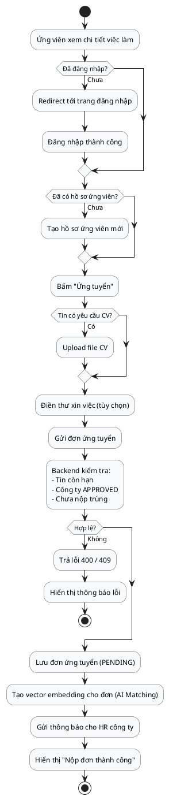

---

## 3. Activity Diagram — Đăng ký & Duyệt công ty

```plantuml
@startuml AD_RegisterCompany
skinparam activityBackgroundColor #f8f9fa
start

:Chủ công ty điền form đăng ký\n(thông tin cá nhân + công ty + chi nhánh + minh chứng);
:Upload minh chứng pháp lý lên Cloudinary;
:Gửi POST /api/v1/auth/register-owner;

:Backend tạo tài khoản Owner;
:Backend tạo hồ sơ công ty (PENDING);
:Backend tạo chi nhánh chính;
:Backend lưu danh sách minh chứng;
:Gửi email thông tin đăng nhập cho Owner;

:Owner đăng nhập vào company-admin;
note right: Trạng thái PENDING\nChưa được đăng tin

|Admin hệ thống|
:Vào trang Quản lý công ty;
:Xem chi tiết công ty + minh chứng;
if (Quyết định?) then (Duyệt)
  :Cập nhật trạng thái APPROVED;
  :Cập nhật minh chứng APPROVED;
  :Gửi thông báo cho Owner;
  |Owner|
  :Nhận thông báo "Công ty đã được duyệt";
  :Có thể đăng ký gói & đăng tin;
else (Từ chối)
  :Nhập lý do từ chối;
  :Cập nhật trạng thái REJECTED;
  :Gửi thông báo + lý do cho Owner;
  |Owner|
  :Nhận thông báo "Công ty bị từ chối";
  :Chỉnh sửa thông tin / minh chứng;
  :Gửi duyệt lại (PATCH /company/resubmit);
endif

stop
@enduml
```

---

## 4. Activity Diagram — Đăng ký gói & Thanh toán SePay

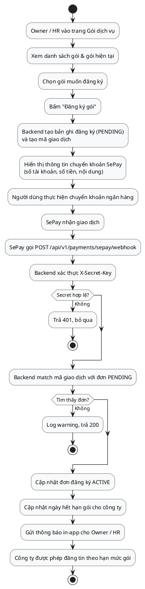

---

## 5. Activity Diagram — AI Search việc làm (LangChain4j + Gemini)

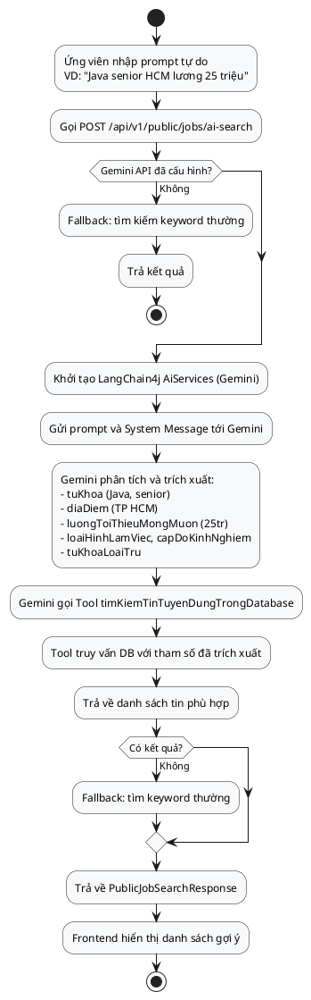

---

## 6. Activity Diagram — HR cập nhật trạng thái đơn ứng tuyển

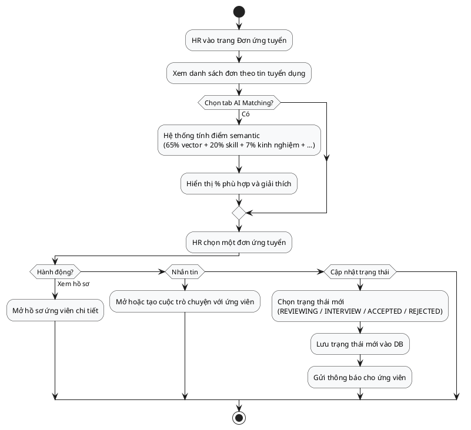

---

## 7. Sequence Diagram — Đăng nhập

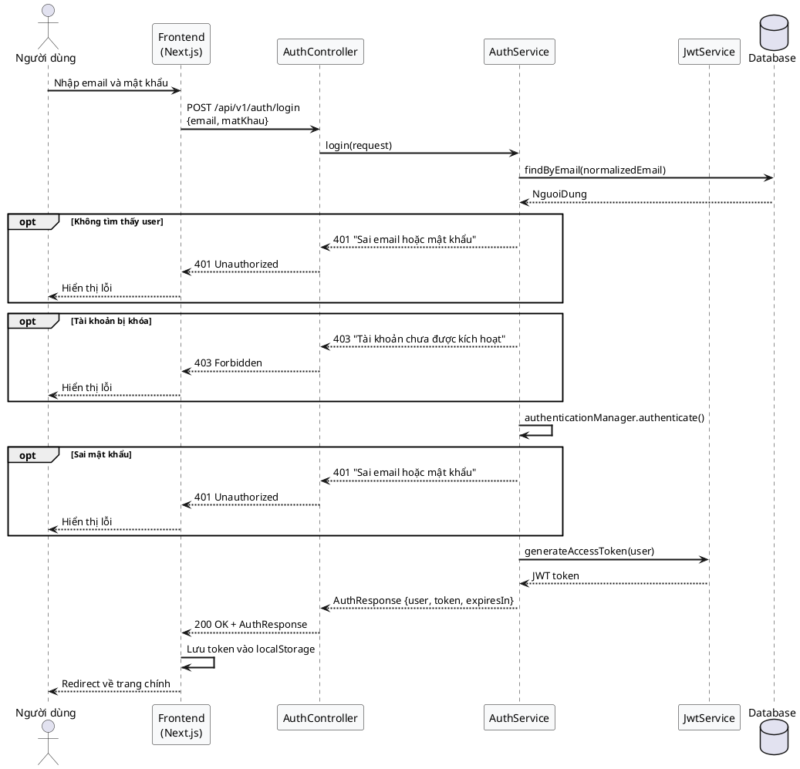

---

## 8. Sequence Diagram — Đăng ký tài khoản ứng viên

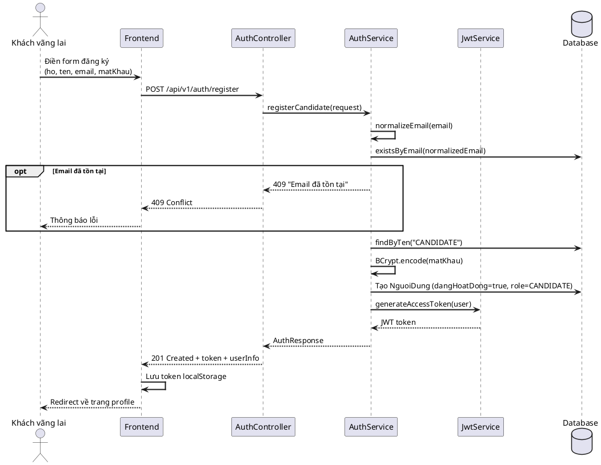

---

## 9. Sequence Diagram — Nộp đơn ứng tuyển

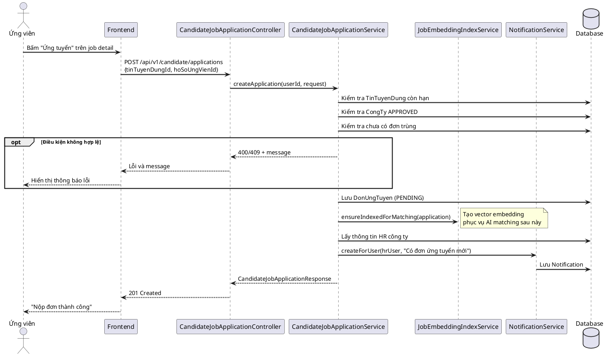

---

## 10. Sequence Diagram — AI Semantic Matching (HR tìm ứng viên phù hợp)

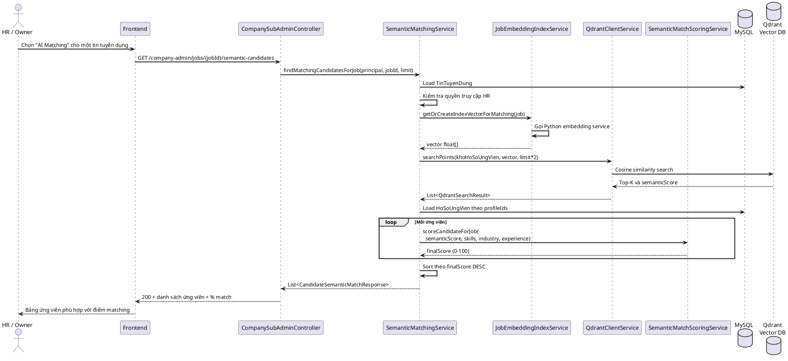

---

## 11. Sequence Diagram — Chat realtime (WebSocket)

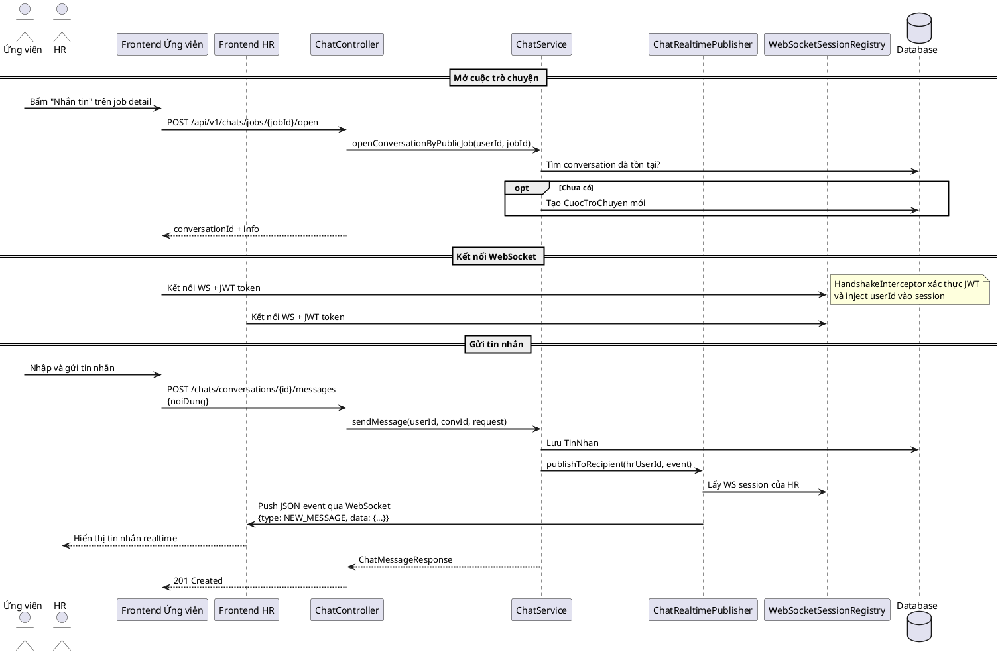

---

## 12. Sequence Diagram — Admin duyệt công ty

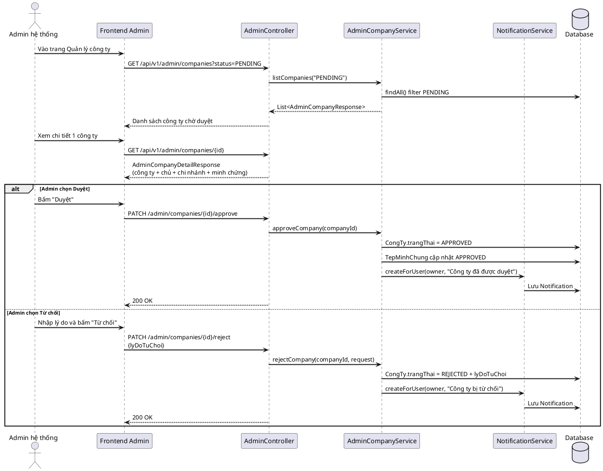

---

## 13. Robustness Diagram — Nộp đơn ứng tuyển

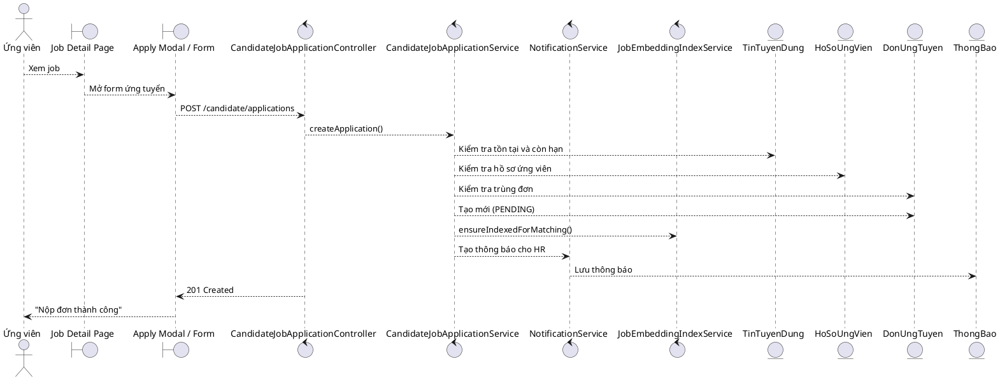

---

## 14. Robustness Diagram — Đăng ký gói & Thanh toán

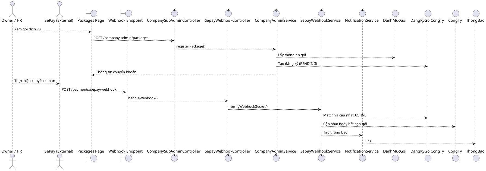

---

## 15. Robustness Diagram — AI Semantic Matching

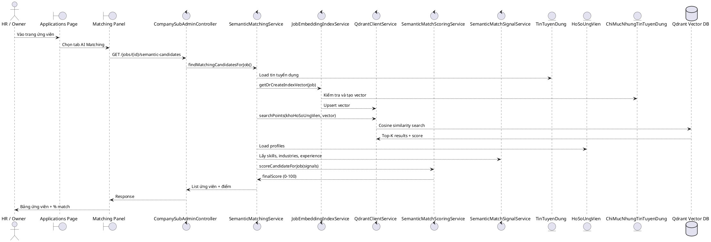

---

## 16. Robustness Diagram — Chat realtime

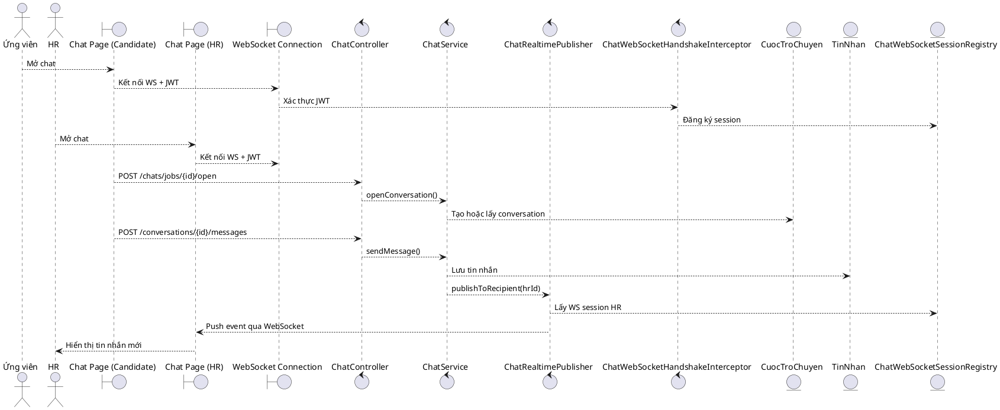

---

## 17. Class Diagram — Domain Model chính

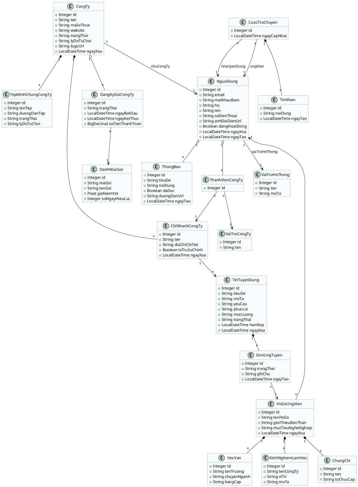

---

## 18. Component Diagram — Kiến trúc hệ thống

```plantuml
@startuml COMP_Architecture
skinparam componentBackgroundColor #f8f9fa
skinparam packageBackgroundColor #e9ecef
skinparam databaseBackgroundColor #d4edda

package "Client Layer" {
  [Next.js Frontend] as FE
  [WebSocket Client] as WSClient
}

package "Backend - Spring Boot" {

  package "API / Controller Layer" {
    [AuthController] as AuthCtrl
    [CandidateProfileController] as CandidateCtrl
    [CandidateJobApplicationController] as AppCtrl
    [CompanySubAdminController] as CompanyCtrl
    [AdminController] as AdminCtrl
    [ChatController] as ChatCtrl
    [PublicJobController] as PublicCtrl
    [NotificationController] as NotifCtrl
    [SepayWebhookController] as SepayCtrl
    [CandidateFavoriteJobController] as FavCtrl
  }

  package "Service Layer" {
    [AuthService] as AuthSvc
    [CandidateProfileService] as ProfileSvc
    [CompanyAdminService] as CompanySvc
    [ChatService] as ChatSvc
    [PublicJobAiSearchService] as AiSearchSvc
    [SemanticMatchingService] as MatchSvc
    [NotificationService] as NotifSvc
    [SepayWebhookService] as SepaySvc
    [CompanyHrManagementService] as HrMgmtSvc
  }

  package "AI / Embedding Layer" {
    [JobEmbeddingIndexService] as JobEmbed
    [CandidateProfileEmbeddingIndexService] as ProfileEmbed
    [ApplicationEmbeddingIndexService] as AppEmbed
    [SemanticMatchScoringService] as ScoreSvc
    [PythonHttpEmbeddingService] as PythonEmbed
  }

  package "Infrastructure" {
    [JwtAuthenticationFilter] as JwtFilter
    [ChatWebSocketHandler] as WSHandler
    [ChatWebSocketSessionRegistry] as WSRegistry
    [ChatRealtimePublisher] as WSPublisher
    [QdrantClientService] as QdrantClient
  }
}

package "External Services" {
  database "MySQL" as MySQL
  database "Qdrant Vector DB" as Qdrant
  [Cloudinary] as Cloudinary
  [Google Gemini API] as Gemini
  [Python Embedding Service] as PyService
  [SePay Payment Gateway] as SePay
}

FE --> AuthCtrl : REST
FE --> CandidateCtrl
FE --> AppCtrl
FE --> CompanyCtrl
FE --> AdminCtrl
FE --> ChatCtrl
FE --> PublicCtrl
FE --> NotifCtrl
FE --> FavCtrl

WSClient --> WSHandler : WebSocket (ws://)

AuthCtrl --> AuthSvc
CandidateCtrl --> ProfileSvc
AppCtrl --> ProfileSvc
CompanyCtrl --> CompanySvc
CompanyCtrl --> MatchSvc
AdminCtrl --> MatchSvc
ChatCtrl --> ChatSvc
PublicCtrl --> AiSearchSvc
NotifCtrl --> NotifSvc
SepayCtrl --> SepaySvc

AuthSvc --> MySQL
ProfileSvc --> MySQL
CompanySvc --> MySQL
ChatSvc --> MySQL
SepaySvc --> MySQL
NotifSvc --> MySQL

AiSearchSvc --> Gemini : LangChain4j
MatchSvc --> QdrantClient
JobEmbed --> PythonEmbed
ProfileEmbed --> PythonEmbed
AppEmbed --> PythonEmbed
PythonEmbed --> PyService
QdrantClient --> Qdrant

WSHandler --> WSRegistry
ChatSvc --> WSPublisher
WSPublisher --> WSRegistry
WSPublisher --> WSClient : Push realtime event

FE --> Cloudinary : Direct upload (signed)
SePay --> SepayCtrl : Webhook callback

JwtFilter ..> AuthCtrl : intercept all requests
@enduml
```

---

## 19. Activity Diagram — Owner/HR tạo tin tuyển dụng

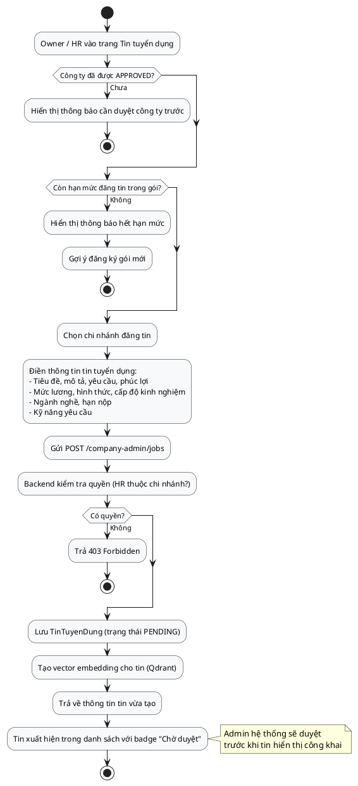

---

## 20. Activity Diagram — Ứng viên cập nhật hồ sơ CV

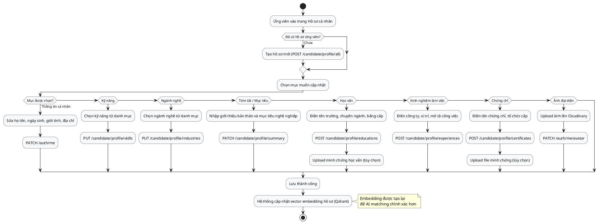

---

## 21. Activity Diagram — Admin duyệt tin tuyển dụng

```plantuml
@startuml AD_AdminReviewJob
skinparam activityBackgroundColor #f8f9fa
start

:Admin vào trang Quản lý tin tuyển dụng;
:Lọc theo trạng thái PENDING;
:Chọn một tin để xem chi tiết;
:Đọc tiêu đề, mô tả, yêu cầu, phúc lợi, kỹ năng;
:Kiểm tra tên công ty và chi nhánh đăng tin;

if (Quyết định?) then (Duyệt)
  :PATCH /admin/jobs/{id}/approve;
  :Tin chuyển sang APPROVED;
  :Tin xuất hiện trên trang tìm việc công khai;
  :Gửi thông báo cho công ty;
else if (Từ chối)
  :Nhập lý do từ chối;
  :PATCH /admin/jobs/{id}/reject;
  :Tin chuyển sang REJECTED;
  :Gửi thông báo + lý do cho công ty;
  fork
    :Công ty chỉnh sửa và gửi lại;
  end fork
else if (Ẩn tin đã duyệt)
  :PATCH /admin/jobs/{id}/hide;
  :Tin chuyển sang HIDDEN;
  :Tin biến mất khỏi trang tìm việc;
  :Không xóa dữ liệu;
endif

stop
@enduml
```

---

## 22. Sequence Diagram — Owner/HR tạo tin tuyển dụng

```plantuml
@startuml SD_CreateJob
skinparam sequenceArrowThickness 2

actor "Owner / HR" as HR
participant "Frontend" as FE
participant "CompanySubAdminController" as Controller
participant "CompanyAdminJobService" as JobService
participant "JobEmbeddingIndexService" as EmbedService
participant "NotificationService" as NotifService
database "MySQL" as DB
database "Qdrant" as QdrantDB

HR -> FE: Điền form tạo tin tuyển dụng
FE -> Controller: GET /company-admin/jobs/metadata
Controller --> FE: Danh mục ngành nghề, loại hình, cấp độ, kỹ năng

HR -> FE: Submit form
FE -> Controller: POST /company-admin/jobs\n{chiNhanhId, tieuDe, moTa, yeuCau,\n mucLuong, hanNop, kyNangIds, ...}
Controller -> JobService: createJob(principal, request)

JobService -> DB: Kiểm tra ThanhVienCongTy có quyền với chi nhánh
alt Không có quyền
  JobService --> Controller: 403 Forbidden
  Controller --> FE: Lỗi quyền truy cập
end

JobService -> DB: Kiểm tra công ty APPROVED và còn hạn mức đăng tin
alt Hết hạn mức
  JobService --> Controller: 400 "Hết hạn mức đăng tin"
  Controller --> FE: Gợi ý đăng ký gói
end

JobService -> DB: Lưu TinTuyenDung (PENDING)
JobService -> DB: Lưu kỹ năng liên kết (TinTuyenDungKyNang)
JobService -> EmbedService: indexJobAsync(job)
EmbedService -> QdrantDB: Upsert vector embedding

Controller --> FE: 201 Created + CompanyAdminJobResponse
FE --> HR: Tin tuyển dụng tạo thành công\nbadge "Chờ duyệt"
@enduml
```

---

## 23. Sequence Diagram — Owner quản lý tài khoản HR

```plantuml
@startuml SD_ManageHR
skinparam sequenceArrowThickness 2

actor "Owner" as Owner
participant "Frontend" as FE
participant "CompanySubAdminController" as Controller
participant "CompanyHrManagementService" as HrService
participant "HrCredentialMailService" as MailService
database "Database" as DB

== Xem danh sách HR ==
Owner -> FE: Vào trang Quản lý HR
FE -> Controller: GET /company-admin/hrs
Controller -> HrService: listHrs(principal)
HrService -> DB: Lấy ThanhVienCongTy với role HR
HrService --> Controller: List<CompanyAdminHrResponse>
Controller --> FE: Danh sách HR

== Tạo HR mới ==
Owner -> FE: Điền form tạo HR\n(ho, ten, email, chiNhanhId)
FE -> Controller: POST /company-admin/hrs\n{ten, ho, email, chiNhanhId}
Controller -> HrService: createHr(principal, request)
HrService -> DB: Kiểm tra email chưa tồn tại
HrService -> DB: Tạo NguoiDung mới (role CANDIDATE)
HrService -> DB: Tạo ThanhVienCongTy (role HR, chiNhanh)
HrService -> DB: Tạo HoSoNhaTuyenDung
HrService -> MailService: sendInitialPassword(email, password)
note right: Hiện tại chỉ log\nChưa gửi email thật
Controller --> FE: 201 Created
FE --> Owner: "Tạo HR thành công"

== Sửa thông tin HR ==
Owner -> FE: Sửa chi nhánh hoặc thông tin HR
FE -> Controller: PATCH /company-admin/hrs/{hrUserId}
Controller -> HrService: updateHr(principal, hrUserId, request)
HrService -> DB: Cập nhật ThanhVienCongTy
Controller --> FE: 200 OK

== Xóa HR ==
Owner -> FE: Bấm "Xóa" HR
FE -> Controller: DELETE /company-admin/hrs/{hrUserId}
Controller -> HrService: deleteHr(principal, hrUserId)
HrService -> DB: Soft delete ThanhVienCongTy
HrService -> DB: Soft delete NguoiDung (ngayXoa)
Controller --> FE: 200 OK
FE --> Owner: Cập nhật danh sách
@enduml
```

---

## 24. Sequence Diagram — Admin duyệt tin tuyển dụng

```plantuml
@startuml SD_AdminReviewJob
skinparam sequenceArrowThickness 2

actor "Admin hệ thống" as Admin
participant "Frontend Admin" as FE
participant "AdminController" as Controller
participant "AdminJobService" as Service
participant "NotificationService" as NotifSvc
database "Database" as DB

Admin -> FE: Vào trang Quản lý tin tuyển dụng
FE -> Controller: GET /api/v1/admin/jobs?trangThai=PENDING
Controller -> Service: listJobs(filters)
Service -> DB: Lấy danh sách tin PENDING
Controller --> FE: List<AdminJobResponse>

Admin -> FE: Xem chi tiết tin
FE -> Controller: GET /api/v1/admin/jobs/{jobId}
Controller --> FE: AdminJobDetailResponse\n(tiêu đề, mô tả, yêu cầu, phúc lợi, kỹ năng, công ty)

alt Admin duyệt tin
  Admin -> FE: Bấm "Duyệt"
  FE -> Controller: PATCH /admin/jobs/{jobId}/approve
  Controller -> Service: approveJob(jobId)
  Service -> DB: TinTuyenDung.trangThai = APPROVED
  Service -> NotifSvc: Thông báo cho công ty
  NotifSvc -> DB: Lưu Notification
  Controller --> FE: 200 OK
  FE --> Admin: Tin chuyển sang APPROVED

else Admin từ chối tin
  Admin -> FE: Nhập lý do + Bấm "Từ chối"
  FE -> Controller: PATCH /admin/jobs/{jobId}/reject\n{lyDoTuChoi}
  Controller -> Service: rejectJob(jobId, reason)
  Service -> DB: TinTuyenDung.trangThai = REJECTED
  Service -> NotifSvc: Thông báo + lý do cho công ty
  NotifSvc -> DB: Lưu Notification
  Controller --> FE: 200 OK

else Admin ẩn tin đã duyệt
  Admin -> FE: Bấm "Ẩn tin"
  FE -> Controller: PATCH /admin/jobs/{jobId}/hide
  Controller -> Service: hideJob(jobId)
  Service -> DB: TinTuyenDung.trangThai = HIDDEN
  Controller --> FE: 200 OK
  FE --> Admin: Tin biến khỏi danh sách công khai
end
@enduml
```

---

## 25. Robustness Diagram — Tạo tin tuyển dụng

```plantuml
@startuml RD_CreateJob
skinparam classBackgroundColor #f8f9fa

actor "Owner / HR" as HR

boundary "Jobs Page" as JobsPage
boundary "Job Form Modal" as JobForm

control "CompanySubAdminController" as Ctrl
control "CompanyAdminJobService" as JobSvc
control "JobEmbeddingIndexService" as EmbedSvc

entity "TinTuyenDung" as Job
entity "ThanhVienCongTy" as Member
entity "DangKyGoiCongTy" as Subscription
entity "KyNang" as Skill
entity "ChiMucNhungTinTuyenDung" as JobIndex

HR --> JobsPage : Vào trang tin tuyển dụng
JobsPage --> JobForm : Mở form tạo mới
JobForm --> Ctrl : POST /company-admin/jobs
Ctrl --> JobSvc : createJob(principal, request)
JobSvc --> Member : Kiểm tra quyền với chi nhánh
JobSvc --> Subscription : Kiểm tra hạn mức đăng tin
JobSvc --> Job : Lưu TinTuyenDung (PENDING)
JobSvc --> Skill : Liên kết kỹ năng yêu cầu
JobSvc --> EmbedSvc : indexJobAsync(job)
EmbedSvc --> JobIndex : Tạo vector embedding
Ctrl --> JobForm : 201 Created
JobForm --> HR : "Tạo tin thành công - Chờ duyệt"
@enduml
```

---

## 26. Robustness Diagram — Owner quản lý HR

```plantuml
@startuml RD_ManageHR
skinparam classBackgroundColor #f8f9fa

actor "Owner (Chủ công ty)" as Owner

boundary "HR Management Page" as HRPage
boundary "HR Form" as HRForm

control "CompanySubAdminController" as Ctrl
control "CompanyHrManagementService" as HrSvc
control "HrCredentialMailService" as MailSvc

entity "NguoiDung" as User
entity "ThanhVienCongTy" as Member
entity "VaiTroCongTy" as Role
entity "HoSoNhaTuyenDung" as RecruiterProfile
entity "ChiNhanhCongTy" as Branch

Owner --> HRPage : Xem danh sách HR
HRPage --> Ctrl : GET /company-admin/hrs
Ctrl --> HrSvc : listHrs(principal)
HrSvc --> Member : Lấy thành viên role HR
HrSvc --> HRPage : Danh sách HR

Owner --> HRForm : Tạo HR mới
HRForm --> Ctrl : POST /company-admin/hrs
Ctrl --> HrSvc : createHr(principal, request)
HrSvc --> User : Tạo tài khoản mới
HrSvc --> Role : Gán vai trò HR
HrSvc --> Branch : Gắn chi nhánh
HrSvc --> Member : Tạo ThanhVienCongTy
HrSvc --> RecruiterProfile : Tạo hồ sơ nhà tuyển dụng
HrSvc --> MailSvc : sendInitialPassword()
HrSvc --> HRForm : HR được tạo thành công

Owner --> HRPage : Xóa HR
HRPage --> Ctrl : DELETE /company-admin/hrs/{id}
Ctrl --> HrSvc : deleteHr(principal, hrId)
HrSvc --> Member : Soft delete ThanhVienCongTy
HrSvc --> User : Soft delete NguoiDung
@enduml
```

---

---

## 27. Activity Diagram — Đăng nhập

```plantuml
@startuml AD_Login
skinparam activityBackgroundColor #f8f9fa
|Người dùng|
start
:Truy cập trang đăng nhập;
:Nhập email và mật khẩu;
:Gửi form đăng nhập;

|Hệ thống|
:Chuẩn hóa email (lowercase, trim);
if (Email tồn tại trong DB?) then (Không)
  :Trả lỗi 401;
  |Người dùng|
  :Hiển thị "Sai email hoặc mật khẩu";
  stop
endif
if (Tài khoản đang hoạt động?) then (Không)
  :Trả lỗi 403;
  |Người dùng|
  :Hiển thị "Tài khoản bị khóa";
  stop
endif
if (Mật khẩu đúng?) then (Không)
  :Trả lỗi 401;
  |Người dùng|
  :Hiển thị "Sai email hoặc mật khẩu";
  stop
endif
:Tạo JWT access token;
:Trả AuthResponse {user, token};
|Người dùng|
:Lưu token vào localStorage;
if (Vai trò?) then (CANDIDATE)
  :Redirect về trang chủ;
else if (EMPLOYER / HR)
  :Redirect về company-admin;
else (ADMIN)
  :Redirect về admin dashboard;
endif
stop
@enduml
```

---

## 28. Activity Diagram — Đăng ký tài khoản ứng viên

```plantuml
@startuml AD_RegisterCandidate
skinparam activityBackgroundColor #f8f9fa
start
:Ứng viên điền form đăng ký\n(họ, tên, email, mật khẩu);
:Gửi POST /api/v1/auth/register;

if (Email đã tồn tại?) then (Có)
  :Trả lỗi 409 "Email đã tồn tại";
  :Hiển thị thông báo lỗi;
  stop
endif
:Chuẩn hóa email (lowercase, trim);
:BCrypt encode mật khẩu;
:Tạo NguoiDung (role=CANDIDATE, dangHoatDong=true);
:Tạo JWT access token;
:Trả 201 Created + token;
:Lưu token vào localStorage;
:Redirect về trang hồ sơ;
stop
@enduml
```

---

## 29. Activity Diagram — Đăng ký tài khoản chủ công ty

```plantuml
@startuml AD_RegisterOwner
skinparam activityBackgroundColor #f8f9fa
start
:Chủ công ty truy cập trang đăng ký doanh nghiệp;
:Điền thông tin cá nhân (họ, tên, email, mật khẩu);
:Điền thông tin công ty (tên, mã số thuế, website);
:Điền thông tin chi nhánh chính (địa chỉ, tỉnh/thành);
:Upload minh chứng pháp lý lên Cloudinary\n(CCCD, giấy đăng ký kinh doanh...);
:Gửi POST /api/v1/auth/register-owner;

if (Email đã tồn tại?) then (Có)
  :Trả lỗi 409;
  stop
endif
if (Mã số thuế đã đăng ký?) then (Có)
  :Trả lỗi 409;
  stop
endif

:Tạo NguoiDung (role=CANDIDATE, dangHoatDong=true);
:Tạo CongTy (trangThai=PENDING);
:Tạo ChiNhanhCongTy (laTruSoChinh=true);
:Tạo ThanhVienCongTy (vaiTro=OWNER);
:Lưu danh sách TepMinhChungCongTy (trangThai=PENDING);
:Tạo JWT token và trả 201 Created;
:Redirect về company-admin;
note right: Công ty ở trạng thái PENDING\nChờ admin hệ thống duyệt
stop
@enduml
```

---

## 30. Activity Diagram — Ứng viên lưu/bỏ lưu việc làm yêu thích

```plantuml
@startuml AD_FavoriteJob
skinparam activityBackgroundColor #f8f9fa
start
:Ứng viên xem chi tiết việc làm;
if (Đã đăng nhập?) then (Chưa)
  :Redirect tới trang đăng nhập;
  :Đăng nhập thành công;
endif

:Kiểm tra trạng thái yêu thích\nGET /candidate/favorite-jobs/{jobId}/status;

if (Đã lưu yêu thích?) then (Rồi)
  :Bấm nút "Bỏ lưu";
  :DELETE /candidate/favorite-jobs/{jobId};
  :Xóa bản ghi yêu thích khỏi DB;
  :Cập nhật UI: nút về trạng thái "Lưu";
else (Chưa)
  :Bấm nút "Lưu việc làm";
  :POST /candidate/favorite-jobs/{jobId};
  if (Đã tồn tại bản ghi?) then (Rồi)
    :Trả về favorite=true (idempotent);
  else (Chưa)
    :Tạo bản ghi NguoiDungTinTuyenDung mới;
  endif
  :Cập nhật UI: nút về trạng thái "Đã lưu";
endif
stop
@enduml
```

---

## 31. Activity Diagram — Chat realtime giữa ứng viên và HR

```plantuml
@startuml AD_Chat
skinparam activityBackgroundColor #f8f9fa
|Ứng viên|
start
:Bấm "Nhắn tin" trên trang job detail;
:POST /chats/jobs/{jobId}/open;

|Hệ thống|
if (Conversation đã tồn tại?) then (Có)
  :Trả về conversation cũ;
else (Chưa)
  :Tạo CuocTroChuyen mới;
  :Liên kết ứng viên và HR phụ trách;
endif
:Trả conversationId về frontend;

|Ứng viên|
:Kết nối WebSocket với JWT token;
:HandshakeInterceptor xác thực JWT;
:Đăng ký session vào SessionRegistry;
:Giao diện chat mở;
:Nhập và gửi tin nhắn;
:POST /chats/conversations/{id}/messages;

|Hệ thống|
:Lưu TinNhan vào DB;
:Lấy WS session của HR từ SessionRegistry;
if (HR đang online?) then (Có)
  :Push event NEW_MESSAGE qua WebSocket;
  |HR|
  :Nhận tin nhắn realtime;
else (Không)
  :Tin nhắn lưu DB, HR sẽ thấy khi vào lại;
endif

|Ứng viên|
:Hiển thị tin nhắn đã gửi trong UI;
stop
@enduml
```

---

## 32. Activity Diagram — Quản lý thông báo in-app

```plantuml
@startuml AD_Notification
skinparam activityBackgroundColor #f8f9fa
|Hệ thống|
start
:Sự kiện nghiệp vụ xảy ra\n(duyệt công ty, có đơn mới, duyệt tin...);
:NotificationService.createForUser();
:Lưu ThongBao vào DB\n(daDoc=false);

|Người dùng|
:Vào bất kỳ trang nào có header;
:GET /notifications/unread-count;
:Hiển thị badge số thông báo chưa đọc;
:Bấm vào icon thông báo;
:GET /notifications?trang=0;
:Hiển thị danh sách thông báo;

if (Hành động?) then (Đọc một thông báo)
  :PATCH /notifications/{id}/read;
  :daDoc = true;
  :Badge giảm 1;
else if (Đọc tất cả)
  :PATCH /notifications/read-all;
  :Tất cả daDoc = true;
  :Badge về 0;
else if (Xóa thông báo)
  :DELETE /notifications/{id};
  :Xóa khỏi DB;
  :Cập nhật danh sách UI;
endif
stop
@enduml
```

---

## 33. Activity Diagram — Admin khóa/mở/xóa tài khoản người dùng

```plantuml
@startuml AD_AdminManageUser
skinparam activityBackgroundColor #f8f9fa
|Admin hệ thống|
start
:Vào trang Quản lý người dùng;
:GET /admin/users?keyword=...&role=...&status=...;
:Lọc danh sách user theo bộ lọc;
:Chọn một user;

if (Hành động?) then (Khóa tài khoản)
  :PATCH /admin/users/{id}/status\n{dangHoatDong: false};
  |Hệ thống|
  :Cập nhật NguoiDung.dangHoatDong = false;
  :User không thể đăng nhập;
  |Admin hệ thống|
  :Hiển thị trạng thái INACTIVE;
else if (Mở khóa tài khoản)
  :PATCH /admin/users/{id}/status\n{dangHoatDong: true};
  |Hệ thống|
  :Cập nhật NguoiDung.dangHoatDong = true;
  |Admin hệ thống|
  :Hiển thị trạng thái ACTIVE;
else if (Xóa tài khoản)
  :DELETE /admin/users/{id};
  |Hệ thống|
  :NguoiDung.dangHoatDong = false;
  :NguoiDung.ngayXoa = now() (soft delete);
  |Admin hệ thống|
  :User biến khỏi danh sách;
endif
stop
@enduml
```

---

## 34. Sequence Diagram — Đăng ký chủ công ty

```plantuml
@startuml SD_RegisterOwner
skinparam sequenceArrowThickness 2

actor "Chủ công ty" as Owner
participant "Frontend" as FE
participant "AuthController" as AC
participant "OwnerRegistrationService" as ORS
participant "CloudinaryStorageService" as Cloud
database "Database" as DB

Owner -> FE: Upload file minh chứng
FE -> Cloud: Lấy chữ ký upload\nGET /auth/cloudinary-signature
Cloud --> FE: {signature, timestamp, apiKey}
FE -> Cloud: Upload trực tiếp lên Cloudinary
Cloud --> FE: {secureUrl}

Owner -> FE: Submit form đăng ký
FE -> AC: POST /api/v1/auth/register-owner\n{userInfo, companyInfo, branchInfo, proofs[]}
AC -> ORS: registerOwner(request)

ORS -> DB: existsByEmail(email)
opt Email tồn tại
  ORS --> AC: 409 "Email đã tồn tại"
  AC --> FE: 409 Conflict
  FE --> Owner: Thông báo lỗi
end

ORS -> DB: Tạo NguoiDung (CANDIDATE role)
ORS -> DB: Tạo CongTy (trangThai=PENDING)
ORS -> DB: Tạo ChiNhanhCongTy (laTruSoChinh=true)
ORS -> DB: Tạo ThanhVienCongTy (role=OWNER)
ORS -> DB: Lưu TepMinhChungCongTy[] (trangThai=PENDING)
ORS -> ORS: generateAccessToken(user)
ORS --> AC: CreateOwnerResponse {user, company, token}
AC --> FE: 201 Created
FE --> Owner: Redirect về company-admin\n(hiển thị trạng thái PENDING)
@enduml
```

---

## 35. Sequence Diagram — Ứng viên cập nhật hồ sơ CV

```plantuml
@startuml SD_ManageCV
skinparam sequenceArrowThickness 2

actor "Ứng viên" as Candidate
participant "Frontend" as FE
participant "CandidateProfileController" as ProfCtrl
participant "CandidateProfileService" as ProfSvc
participant "CandidateProfileEmbeddingIndexService" as EmbedSvc
database "Database" as DB
database "Qdrant" as Qdrant

Candidate -> FE: Vào trang hồ sơ
FE -> ProfCtrl: GET /candidate/profile/all
ProfCtrl --> FE: Danh sách hồ sơ + active profileId
FE -> ProfCtrl: GET /candidate/profile/metadata
ProfCtrl --> FE: Danh mục kỹ năng, ngành nghề

Candidate -> FE: Thêm Học vấn mới
FE -> ProfCtrl: POST /candidate/profile/educations\n{tenTruong, chuyenNganh, bangCap, ...}
ProfCtrl -> ProfSvc: createEducation(userId, profileId, request)
ProfSvc -> DB: Lưu HocVan
ProfSvc -> EmbedSvc: reindexProfileAsync(profile)
EmbedSvc -> Qdrant: Cập nhật vector embedding hồ sơ
ProfCtrl --> FE: 201 Created

Candidate -> FE: Cập nhật Kỹ năng
FE -> ProfCtrl: PUT /candidate/profile/{profileId}/skills\n{kyNangIds: [1,3,5]}
ProfCtrl -> ProfSvc: updateSkills(userId, profileId, request)
ProfSvc -> DB: Xóa kỹ năng cũ, lưu kỹ năng mới
ProfSvc -> EmbedSvc: reindexProfileAsync(profile)
EmbedSvc -> Qdrant: Cập nhật vector embedding
ProfCtrl --> FE: 200 OK

Candidate -> FE: Cập nhật Tóm tắt / Mục tiêu nghề nghiệp
FE -> ProfCtrl: PATCH /candidate/profile/{profileId}/summary\n{gioiThieuBanThan, mucTieuNgheNghiep}
ProfCtrl -> ProfSvc: updateSummary(userId, profileId, request)
ProfSvc -> DB: Cập nhật HoSoUngVien
ProfSvc -> EmbedSvc: reindexProfileAsync(profile)
EmbedSvc -> Qdrant: Cập nhật vector
ProfCtrl --> FE: 200 OK
FE --> Candidate: Hồ sơ cập nhật thành công
@enduml
```

---

## 36. Sequence Diagram — Ứng viên lưu/bỏ lưu việc yêu thích

```plantuml
@startuml SD_FavoriteJob
skinparam sequenceArrowThickness 2

actor "Ứng viên" as Candidate
participant "Frontend" as FE
participant "CandidateFavoriteJobController" as Ctrl
participant "CandidateFavoriteJobService" as Svc
database "Database" as DB

Candidate -> FE: Vào trang chi tiết job
FE -> Ctrl: GET /candidate/favorite-jobs/{jobId}/status
Ctrl -> Svc: getStatus(userId, jobId)
Svc -> DB: Tìm NguoiDungTinTuyenDung
Svc --> Ctrl: FavoriteJobStatusResponse {yeuThich: true/false}
Ctrl --> FE: 200 OK
FE --> Candidate: Hiển thị trạng thái nút Lưu

alt Ứng viên bấm "Lưu yêu thích"
  Candidate -> FE: Bấm nút Lưu
  FE -> Ctrl: POST /candidate/favorite-jobs/{jobId}
  Ctrl -> Svc: addFavorite(userId, jobId)
  Svc -> DB: Tìm bản ghi cũ
  opt Chưa tồn tại
    Svc -> DB: Tạo NguoiDungTinTuyenDung mới
  end
  Svc --> Ctrl: {yeuThich: true}
  Ctrl --> FE: 200 OK
  FE --> Candidate: Nút chuyển sang "Đã lưu"

else Ứng viên bấm "Bỏ lưu"
  Candidate -> FE: Bấm nút Bỏ lưu
  FE -> Ctrl: DELETE /candidate/favorite-jobs/{jobId}
  Ctrl -> Svc: removeFavorite(userId, jobId)
  Svc -> DB: Xóa bản ghi NguoiDungTinTuyenDung
  Svc --> Ctrl: {yeuThich: false}
  Ctrl --> FE: 200 OK
  FE --> Candidate: Nút chuyển về "Lưu"
end
@enduml
```

---

## 37. Sequence Diagram — Thông báo in-app

```plantuml
@startuml SD_Notification
skinparam sequenceArrowThickness 2

actor "Người dùng" as User
participant "Frontend" as FE
participant "NotificationController" as Ctrl
participant "NotificationService" as Svc
database "Database" as DB

== Hệ thống tạo thông báo (background) ==
participant "Business Service" as BizSvc
BizSvc -> Svc: createForUser(userId, tieuDe, noiDung, url)
Svc -> DB: Lưu ThongBao (daDoc=false)

== Người dùng xem thông báo ==
User -> FE: Vào trang bất kỳ
FE -> Ctrl: GET /notifications/unread-count
Ctrl -> Svc: getUnreadCount(userId)
Svc -> DB: COUNT daDoc=false
Svc --> Ctrl: {soLuongChuaDoc: 3}
Ctrl --> FE: 200 OK
FE --> User: Badge hiển thị số 3

User -> FE: Bấm icon thông báo
FE -> Ctrl: GET /notifications
Ctrl -> Svc: listMyNotifications(userId, trang, kichThuoc)
Svc -> DB: Lấy danh sách ThongBao theo userId
Svc --> Ctrl: NotificationListResponse
Ctrl --> FE: 200 OK + danh sách
FE --> User: Hiển thị danh sách thông báo

User -> FE: Bấm vào 1 thông báo
FE -> Ctrl: PATCH /notifications/{id}/read
Ctrl -> Svc: markRead(userId, notificationId)
Svc -> DB: ThongBao.daDoc = true
Svc --> Ctrl: NotificationItemResponse
Ctrl --> FE: 200 OK
FE --> User: Badge giảm 1, redirect tới url thông báo
@enduml
```

---

## 38. Sequence Diagram — HR cập nhật trạng thái đơn ứng tuyển

```plantuml
@startuml SD_UpdateApplicationStatus
skinparam sequenceArrowThickness 2

actor "HR / Owner" as HR
participant "Frontend" as FE
participant "CompanySubAdminController" as Ctrl
participant "CompanyAdminApplicationService" as Svc
participant "NotificationService" as NotifSvc
database "Database" as DB

HR -> FE: Vào trang Đơn ứng tuyển
FE -> Ctrl: GET /company-admin/applications?chiNhanhId=...
Ctrl -> Svc: listApplications(principal, chiNhanhId)
Svc -> DB: Lấy DonUngTuyen theo chi nhánh
Svc --> Ctrl: List<CompanyAdminApplication>
Ctrl --> FE: Danh sách đơn ứng tuyển

HR -> FE: Chọn một đơn
FE -> Ctrl: GET /company-admin/applications/{id}
Ctrl --> FE: Chi tiết đơn + hồ sơ ứng viên

HR -> FE: Chọn trạng thái mới\n(REVIEWING / ACCEPTED / REJECTED)
FE -> Ctrl: PATCH /company-admin/applications/{id}/status\n{trangThai: "REVIEWING"}
Ctrl -> Svc: updateApplicationStatus(principal, appId, request)

Svc -> DB: Kiểm tra quyền HR với chi nhánh
opt Không có quyền
  Svc --> Ctrl: 403 Forbidden
  Ctrl --> FE: Lỗi
end

Svc -> DB: Cập nhật DonUngTuyen.trangThai
Svc -> DB: Lấy thông tin ứng viên
Svc -> NotifSvc: createForUser(ungVien, "Đơn của bạn đã được cập nhật", ...)
NotifSvc -> DB: Lưu ThongBao cho ứng viên
Svc --> Ctrl: CompanyAdminApplicationResponse
Ctrl --> FE: 200 OK
FE --> HR: Cập nhật badge trạng thái đơn
@enduml
```

---

## 39. Sequence Diagram — Admin khóa/xóa người dùng

```plantuml
@startuml SD_AdminManageUser
skinparam sequenceArrowThickness 2

actor "Admin hệ thống" as Admin
participant "Frontend Admin" as FE
participant "AdminController" as Ctrl
participant "AdminUserService" as Svc
database "Database" as DB

Admin -> FE: GET /admin/users?keyword=...&role=...&status=...
Ctrl -> Svc: listUsers(keyword, role, status)
Svc -> DB: findAll() + filter in-memory
Svc --> Ctrl: List<AdminUserResponse>
Ctrl --> FE: Danh sách người dùng

alt Admin khóa tài khoản
  Admin -> FE: Bấm "Khóa tài khoản"
  FE -> Ctrl: PATCH /admin/users/{id}/status\n{dangHoatDong: false}
  Ctrl -> Svc: updateUserStatus(userId, request)
  Svc -> DB: NguoiDung.dangHoatDong = false
  Svc --> Ctrl: AdminUserResponse (trangThai=INACTIVE)
  Ctrl --> FE: 200 OK
  FE --> Admin: Badge INACTIVE

else Admin mở khóa
  Admin -> FE: Bấm "Mở khóa"
  FE -> Ctrl: PATCH /admin/users/{id}/status\n{dangHoatDong: true}
  Ctrl -> Svc: updateUserStatus(userId, request)
  Svc -> DB: NguoiDung.dangHoatDong = true
  Svc --> Ctrl: AdminUserResponse (trangThai=ACTIVE)
  Ctrl --> FE: 200 OK

else Admin xóa tài khoản
  Admin -> FE: Bấm "Xóa"
  FE -> Ctrl: DELETE /admin/users/{id}
  Ctrl -> Svc: deleteUser(userId)
  Svc -> DB: dangHoatDong=false, ngayXoa=now() (soft delete)
  Ctrl --> FE: 200 OK
  FE --> Admin: User biến khỏi danh sách
end
@enduml
```

---

## 40. Sequence Diagram — AI Search việc làm

```plantuml
@startuml SD_AiSearch
skinparam sequenceArrowThickness 2

actor "Ứng viên" as Candidate
participant "Frontend" as FE
participant "PublicJobController" as Ctrl
participant "PublicJobAiSearchService" as AiSvc
participant "Gemini API\n(LangChain4j)" as Gemini
participant "PublicJobDatabaseTool" as Tool
participant "PublicJobService" as JobSvc
database "Database" as DB

Candidate -> FE: Nhập prompt tự do\nVD: "Java senior HCM không yêu cầu tiếng Anh"
FE -> Ctrl: POST /public/jobs/ai-search\n{prompt, gioiHan: 12}
Ctrl -> AiSvc: searchByPrompt(prompt, limit)
AiSvc -> AiSvc: normalizePrompt() + normalizeLimit()

opt Gemini chưa cấu hình
  AiSvc -> JobSvc: searchJobs(prompt, ...)
  JobSvc -> DB: Tìm kiếm keyword thường
  JobSvc --> AiSvc: PublicJobSearchResponse
  AiSvc --> Ctrl: Kết quả fallback
  Ctrl --> FE: 200 OK
end

AiSvc -> AiSvc: Khởi tạo AiServices + PublicJobDatabaseTool
AiSvc -> Gemini: assistant.search(userPrompt) + SystemMessage
note right: SystemMessage hướng dẫn Gemini\ntrích xuất: tuKhoa, diaDiem,\nluong, capDo, loaiHinh, loaiTru...

Gemini -> Tool: timKiemTinTuyenDungTrongDatabase(\n  tuKhoa="Java senior",\n  diaDiem="Hồ Chí Minh",\n  tuKhoaLoaiTru="tiếng Anh")
Tool -> JobSvc: searchJobsForAi(params)
JobSvc -> DB: Truy vấn với tất cả filter đã trích xuất
DB --> JobSvc: Danh sách TinTuyenDung
JobSvc --> Tool: PublicJobSearchResponse
Tool --> Gemini: "Đã tìm thấy 8 tin phù hợp"
Gemini --> AiSvc: Response text

AiSvc -> AiSvc: tool.getLastResult()
AiSvc --> Ctrl: PublicJobSearchResponse
Ctrl --> FE: 200 OK + danh sách tin
FE --> Candidate: Hiển thị kết quả AI search
@enduml
```

---

## 41. Robustness Diagram — Đăng nhập

```plantuml
@startuml RD_Login
skinparam classBackgroundColor #f8f9fa

actor "Người dùng" as User

boundary "Login Page" as LoginPage

control "AuthController" as AuthCtrl
control "AuthService" as AuthSvc
control "JwtService" as JwtSvc

entity "NguoiDung" as UserEntity

User --> LoginPage : Nhập email + mật khẩu
LoginPage --> AuthCtrl : POST /auth/login
AuthCtrl --> AuthSvc : login(request)
AuthSvc --> UserEntity : findByEmail()
AuthSvc --> AuthSvc : validate dangHoatDong
AuthSvc --> AuthSvc : authenticate password
AuthSvc --> JwtSvc : generateAccessToken()
JwtSvc --> AuthSvc : JWT token
AuthSvc --> AuthCtrl : AuthResponse
AuthCtrl --> LoginPage : 200 OK + token
LoginPage --> User : Redirect về trang chính
@enduml
```

---

## 42. Robustness Diagram — Đăng ký ứng viên

```plantuml
@startuml RD_RegisterCandidate
skinparam classBackgroundColor #f8f9fa

actor "Khách vãng lai" as Guest

boundary "Register Page" as RegisterPage

control "AuthController" as AuthCtrl
control "AuthService" as AuthSvc
control "JwtService" as JwtSvc

entity "NguoiDung" as UserEntity
entity "VaiTroHeThong" as Role

Guest --> RegisterPage : Điền thông tin đăng ký
RegisterPage --> AuthCtrl : POST /auth/register
AuthCtrl --> AuthSvc : registerCandidate(request)
AuthSvc --> UserEntity : existsByEmail()
AuthSvc --> Role : findByTen("CANDIDATE")
AuthSvc --> AuthSvc : BCrypt.encode(matKhau)
AuthSvc --> UserEntity : Tạo NguoiDung mới
AuthSvc --> JwtSvc : generateAccessToken()
JwtSvc --> AuthSvc : JWT token
AuthSvc --> AuthCtrl : AuthResponse
AuthCtrl --> RegisterPage : 201 Created
RegisterPage --> Guest : Redirect về trang hồ sơ
@enduml
```

---

## 43. Robustness Diagram — Đăng ký chủ công ty

```plantuml
@startuml RD_RegisterOwner
skinparam classBackgroundColor #f8f9fa

actor "Chủ công ty" as Owner

boundary "Owner Register Page" as RegPage
boundary "Cloudinary" as CloudBoundary

control "AuthController" as AuthCtrl
control "OwnerRegistrationService" as ORS
control "JwtService" as JwtSvc

entity "NguoiDung" as User
entity "CongTy" as Company
entity "ChiNhanhCongTy" as Branch
entity "ThanhVienCongTy" as Member
entity "TepMinhChungCongTy" as Proof

Owner --> RegPage : Điền form + upload minh chứng
RegPage --> CloudBoundary : Upload file trực tiếp
RegPage --> AuthCtrl : POST /auth/register-owner
AuthCtrl --> ORS : registerOwner(request)
ORS --> User : Tạo NguoiDung (CANDIDATE)
ORS --> Company : Tạo CongTy (PENDING)
ORS --> Branch : Tạo ChiNhanhCongTy (truSoChinh)
ORS --> Member : Tạo ThanhVienCongTy (OWNER)
ORS --> Proof : Lưu danh sách minh chứng (PENDING)
ORS --> JwtSvc : generateAccessToken()
ORS --> AuthCtrl : CreateOwnerResponse
AuthCtrl --> RegPage : 201 Created + token
RegPage --> Owner : Redirect company-admin (PENDING)
@enduml
```

---

## 44. Robustness Diagram — Ứng viên cập nhật hồ sơ CV

```plantuml
@startuml RD_ManageCV
skinparam classBackgroundColor #f8f9fa

actor "Ứng viên" as Candidate

boundary "Profile Page" as ProfilePage

control "CandidateProfileController" as ProfCtrl
control "CandidateProfileService" as ProfSvc
control "CandidateProfileEmbeddingIndexService" as EmbedSvc

entity "HoSoUngVien" as Profile
entity "HocVan" as Education
entity "KinhNghiemLamViec" as Experience
entity "ChungChi" as Certificate
entity "ChiMucNhungHoSoUngVien" as ProfileIndex

Candidate --> ProfilePage : Vào trang hồ sơ
ProfilePage --> ProfCtrl : GET /candidate/profile/all
ProfCtrl --> ProfilePage : Danh sách hồ sơ

ProfilePage --> ProfCtrl : POST /candidate/profile/educations
ProfCtrl --> ProfSvc : createEducation()
ProfSvc --> Education : Lưu HocVan
ProfSvc --> EmbedSvc : reindexProfileAsync()
EmbedSvc --> ProfileIndex : Cập nhật vector embedding

ProfilePage --> ProfCtrl : PUT /candidate/profile/{id}/skills
ProfCtrl --> ProfSvc : updateSkills()
ProfSvc --> Profile : Cập nhật kỹ năng
ProfSvc --> EmbedSvc : reindexProfileAsync()

ProfilePage --> ProfCtrl : PATCH /candidate/profile/{id}/summary
ProfCtrl --> ProfSvc : updateSummary()
ProfSvc --> Profile : Cập nhật tóm tắt
ProfSvc --> EmbedSvc : reindexProfileAsync()

ProfCtrl --> ProfilePage : 200 OK
ProfilePage --> Candidate : Hồ sơ đã cập nhật
@enduml
```

---

## 45. Robustness Diagram — Admin duyệt công ty

```plantuml
@startuml RD_AdminReviewCompany
skinparam classBackgroundColor #f8f9fa

actor "Admin hệ thống" as Admin

boundary "Companies Admin Page" as CompanyPage
boundary "Company Detail Modal" as Modal

control "AdminController" as AdminCtrl
control "AdminCompanyService" as AdminSvc
control "NotificationService" as NotifSvc

entity "CongTy" as Company
entity "TepMinhChungCongTy" as Proof
entity "ThongBao" as Notif

Admin --> CompanyPage : Xem danh sách công ty PENDING
CompanyPage --> AdminCtrl : GET /admin/companies?status=PENDING
AdminCtrl --> CompanyPage : List<AdminCompanyResponse>

Admin --> Modal : Xem chi tiết công ty
Modal --> AdminCtrl : GET /admin/companies/{id}
AdminCtrl --> Modal : AdminCompanyDetailResponse

Admin --> Modal : Bấm Duyệt / Từ chối
Modal --> AdminCtrl : PATCH /admin/companies/{id}/approve|reject
AdminCtrl --> AdminSvc : approveCompany() / rejectCompany()
AdminSvc --> Company : Cập nhật trangThai
AdminSvc --> Proof : Cập nhật trạng thái minh chứng
AdminSvc --> NotifSvc : Gửi thông báo cho Owner
NotifSvc --> Notif : Lưu ThongBao
AdminCtrl --> Modal : 200 OK
Modal --> Admin : Cập nhật UI
@enduml
```

---

## 46. Robustness Diagram — Admin duyệt tin tuyển dụng

```plantuml
@startuml RD_AdminReviewJob
skinparam classBackgroundColor #f8f9fa

actor "Admin hệ thống" as Admin

boundary "Jobs Admin Page" as JobPage
boundary "Job Detail Modal" as Modal

control "AdminController" as AdminCtrl
control "AdminJobService" as AdminJobSvc
control "NotificationService" as NotifSvc

entity "TinTuyenDung" as Job
entity "ThongBao" as Notif

Admin --> JobPage : Lọc tin PENDING
JobPage --> AdminCtrl : GET /admin/jobs?trangThai=PENDING
AdminCtrl --> JobPage : List<AdminJobResponse>

Admin --> Modal : Xem chi tiết tin
Modal --> AdminCtrl : GET /admin/jobs/{id}
AdminCtrl --> Modal : AdminJobDetailResponse

Admin --> Modal : Duyệt / Từ chối / Ẩn tin
Modal --> AdminCtrl : PATCH /admin/jobs/{id}/approve|reject|hide
AdminCtrl --> AdminJobSvc : approveJob() / rejectJob() / hideJob()
AdminJobSvc --> Job : Cập nhật trangThai
AdminJobSvc --> NotifSvc : Gửi thông báo cho công ty
NotifSvc --> Notif : Lưu ThongBao
AdminCtrl --> Modal : 200 OK
Modal --> Admin : Cập nhật UI
@enduml
```

---

## 47. Robustness Diagram — Lưu việc làm yêu thích

```plantuml
@startuml RD_FavoriteJob
skinparam classBackgroundColor #f8f9fa

actor "Ứng viên" as Candidate

boundary "Job Detail Page" as JobPage

control "CandidateFavoriteJobController" as FavCtrl
control "CandidateFavoriteJobService" as FavSvc

entity "NguoiDungTinTuyenDung" as Favorite
entity "TinTuyenDung" as Job

Candidate --> JobPage : Xem chi tiết job
JobPage --> FavCtrl : GET /candidate/favorite-jobs/{id}/status
FavCtrl --> FavSvc : getStatus(userId, jobId)
FavSvc --> Favorite : Tìm bản ghi yêu thích
FavSvc --> FavCtrl : {yeuThich: true/false}
FavCtrl --> JobPage : Hiển thị trạng thái nút

Candidate --> JobPage : Bấm Lưu
JobPage --> FavCtrl : POST /candidate/favorite-jobs/{jobId}
FavCtrl --> FavSvc : addFavorite(userId, jobId)
FavSvc --> Job : Kiểm tra job tồn tại
FavSvc --> Favorite : Tạo bản ghi mới (idempotent)
FavCtrl --> JobPage : {yeuThich: true}
JobPage --> Candidate : Nút chuyển sang "Đã lưu"

Candidate --> JobPage : Bấm Bỏ lưu
JobPage --> FavCtrl : DELETE /candidate/favorite-jobs/{jobId}
FavCtrl --> FavSvc : removeFavorite(userId, jobId)
FavSvc --> Favorite : Xóa bản ghi
FavCtrl --> JobPage : {yeuThich: false}
JobPage --> Candidate : Nút về trạng thái "Lưu"
@enduml
```

---

## 48. Robustness Diagram — Thông báo in-app

```plantuml
@startuml RD_Notification
skinparam classBackgroundColor #f8f9fa

actor "Người dùng" as User

boundary "App Header" as Header
boundary "Notification Panel" as Panel

control "NotificationController" as NotifCtrl
control "NotificationService" as NotifSvc

entity "ThongBao" as Notification

User --> Header : Vào bất kỳ trang nào
Header --> NotifCtrl : GET /notifications/unread-count
NotifCtrl --> NotifSvc : getUnreadCount(userId)
NotifSvc --> Notification : COUNT(daDoc=false)
NotifCtrl --> Header : {soLuongChuaDoc}
Header --> User : Badge số thông báo

User --> Panel : Bấm icon thông báo
Panel --> NotifCtrl : GET /notifications
NotifCtrl --> NotifSvc : listMyNotifications()
NotifSvc --> Notification : findAll theo userId
NotifCtrl --> Panel : List<NotificationItemResponse>
Panel --> User : Danh sách thông báo

User --> Panel : Đọc / Xóa thông báo
Panel --> NotifCtrl : PATCH /{id}/read\nDELETE /{id}
NotifCtrl --> NotifSvc : markRead() / deleteNotification()
NotifSvc --> Notification : Cập nhật daDoc / Xóa
NotifCtrl --> Panel : 200 OK
Panel --> User : Cập nhật badge
@enduml
```

---

## 49. Robustness Diagram — AI Search việc làm

```plantuml
@startuml RD_AiSearch
skinparam classBackgroundColor #f8f9fa

actor "Ứng viên" as Candidate

boundary "AI Search Page\n(/jobs/ai)" as AiPage

control "PublicJobController" as Ctrl
control "PublicJobAiSearchService" as AiSvc
control "PublicJobDatabaseTool" as Tool
control "PublicJobService" as JobSvc

entity "TinTuyenDung" as Job

database "Gemini API" as Gemini

Candidate --> AiPage : Nhập prompt tự do
AiPage --> Ctrl : POST /public/jobs/ai-search
Ctrl --> AiSvc : searchByPrompt(prompt, limit)
AiSvc --> Gemini : Phân tích prompt
Gemini --> Tool : gọi timKiemTinTuyenDungTrongDatabase(params)
Tool --> JobSvc : searchJobsForAi(tuKhoa, diaDiem, luong, ...)
JobSvc --> Job : Truy vấn DB với filter
JobSvc --> Tool : PublicJobSearchResponse
Tool --> AiSvc : lastResult
AiSvc --> Ctrl : PublicJobSearchResponse
Ctrl --> AiPage : Danh sách tin phù hợp
AiPage --> Candidate : Hiển thị kết quả
@enduml
```

---

## 50. Robustness Diagram — HR cập nhật trạng thái đơn

```plantuml
@startuml RD_UpdateApplicationStatus
skinparam classBackgroundColor #f8f9fa

actor "HR / Owner" as HR

boundary "Applications Page" as AppPage
boundary "Application Detail" as Detail

control "CompanySubAdminController" as Ctrl
control "CompanyAdminApplicationService" as AppSvc
control "NotificationService" as NotifSvc

entity "DonUngTuyen" as Application
entity "HoSoUngVien" as Profile
entity "ThongBao" as Notif

HR --> AppPage : Vào trang đơn ứng tuyển
AppPage --> Ctrl : GET /company-admin/applications
Ctrl --> AppSvc : listApplications()
AppSvc --> Application : Lấy danh sách đơn
Ctrl --> AppPage : List<CompanyAdminApplication>

HR --> Detail : Chọn đơn cụ thể
Detail --> Ctrl : GET /company-admin/applications/{id}
Ctrl --> AppSvc : getApplication()
AppSvc --> Profile : Load hồ sơ ứng viên
Ctrl --> Detail : Chi tiết đơn + hồ sơ

HR --> Detail : Cập nhật trạng thái
Detail --> Ctrl : PATCH /applications/{id}/status
Ctrl --> AppSvc : updateApplicationStatus()
AppSvc --> Application : Cập nhật trangThai
AppSvc --> NotifSvc : Thông báo cho ứng viên
NotifSvc --> Notif : Lưu ThongBao
Ctrl --> Detail : 200 OK
Detail --> HR : Badge trạng thái đã cập nhật
@enduml
```

---

## 51. State Machine — Vòng đời Tin tuyển dụng

```plantuml
@startuml SM_TinTuyenDung
skinparam stateBackgroundColor #f8f9fa
skinparam stateBorderColor #6c757d
title Vòng đời TinTuyenDung

[*] --> PENDING : Owner/HR tạo tin mới

PENDING --> APPROVED : Admin duyệt
PENDING --> REJECTED : Admin từ chối

APPROVED --> HIDDEN : Admin ẩn tin
APPROVED --> EXPIRED : Quá hạn nộp (hanNop < now)
APPROVED --> REJECTED : Admin từ chối lại

REJECTED --> PENDING : Công ty chỉnh sửa & gửi lại

HIDDEN --> APPROVED : Admin bỏ ẩn
EXPIRED --> [*]
HIDDEN --> [*]

note right of PENDING : Tin chưa hiển thị công khai
note right of APPROVED : Tin hiển thị trên /jobs
note right of HIDDEN : Ẩn không xóa dữ liệu
note right of EXPIRED : Tự động khi quá hanNop
@enduml
```

---

## 52. State Machine — Vòng đời Đơn ứng tuyển

```plantuml
@startuml SM_DonUngTuyen
skinparam stateBackgroundColor #f8f9fa
skinparam stateBorderColor #6c757d
title Vòng đời DonUngTuyen

[*] --> PENDING : Ứng viên nộp đơn

PENDING --> REVIEWING : HR xem xét hồ sơ
REVIEWING --> ACCEPTED : HR chấp nhận
REVIEWING --> REJECTED : HR từ chối
PENDING --> REJECTED : HR từ chối ngay

ACCEPTED --> [*]
REJECTED --> [*]

note right of PENDING : Đơn vừa nộp, HR chưa xem
note right of REVIEWING : HR đang xem xét
note right of ACCEPTED : Ứng viên được chọn
note right of REJECTED : Không phù hợp
@enduml
```

---

## 53. State Machine — Vòng đời Công ty

```plantuml
@startuml SM_CongTy
skinparam stateBackgroundColor #f8f9fa
skinparam stateBorderColor #6c757d
title Vòng đời CongTy

[*] --> PENDING : Chủ công ty đăng ký

PENDING --> APPROVED : Admin duyệt
PENDING --> REJECTED : Admin từ chối

REJECTED --> PENDING : Chủ công ty\nchỉnh sửa & gửi duyệt lại\n(PATCH /company/resubmit)

APPROVED --> APPROVED : Cập nhật thông tin\n(logo, info, chi nhánh...)

note right of PENDING : Chờ admin xét duyệt\nChưa đăng tin được
note right of APPROVED : Hoạt động bình thường\nCó thể đăng ký gói & đăng tin
note right of REJECTED : Bị từ chối\nCó lý do từ chối
@enduml
```

---

## 54. State Machine — Vòng đời Đăng ký gói dịch vụ

```plantuml
@startuml SM_DangKyGoiCongTy
skinparam stateBackgroundColor #f8f9fa
skinparam stateBorderColor #6c757d
title Vòng đời DangKyGoiCongTy

[*] --> PENDING : Công ty đăng ký gói\n(POST /company-admin/packages)

PENDING --> ACTIVE : SePay webhook\nxác nhận thanh toán thành công

PENDING --> [*] : Hết thời gian chờ\n(không thanh toán)

ACTIVE --> EXPIRED : Quá ngayKetThuc\n(tự động hệ thống)

EXPIRED --> PENDING : Công ty đăng ký\ngói tiếp theo

note right of PENDING : Chờ thanh toán\nHiển thị QR SePay
note right of ACTIVE : Gói đang hiệu lực\nCông ty được đăng tin
note right of EXPIRED : Hết hạn gói\nKhông đăng tin mới
@enduml
```

---

## 55. Deployment Diagram — Kiến trúc triển khai

```plantuml
@startuml DEPLOY_Architecture
skinparam nodeBackgroundColor #f8f9fa
skinparam nodeBorderColor #6c757d
skinparam artifactBackgroundColor #e9ecef

title Deployment Diagram — RecruitJobIT

node "Client Browser" as Browser {
  artifact "Next.js Frontend\n(React SSR + CSR)" as FE
}

node "Web Server\n(port 3000)" as WebServer {
  artifact "Next.js App Server" as NextApp
}

node "Application Server\n(port 8080)" as AppServer {
  artifact "Spring Boot Backend\n(Java 21)" as Backend
  artifact "JWT Auth Filter" as JwtFilter
  artifact "WebSocket Handler\n(ws://...)" as WS
}

node "AI Services\n(Docker)" as AINode {
  artifact "Python Embedding Service\n(FastAPI : 8001)\nMiniLM-L12-v2 (384d)" as PyEmbed
  artifact "Qdrant Vector DB\n(port 6333)\n3 collections" as Qdrant
  artifact "Elasticsearch\n(port 9200)\npublic_job_search index" as ES
}

node "Database Server" as DBServer {
  database "MySQL\n(port 3306)" as MySQL
}

cloud "External Services" as Cloud {
  artifact "Cloudinary\n(File Storage)" as Cloudinary
  artifact "Google Gemini API\n(gemini-2.5-flash)" as Gemini
  artifact "SePay\n(Payment Gateway)" as SePay
}

Browser --> WebServer : HTTPS / WebSocket
WebServer --> AppServer : HTTP REST API
AppServer --> DBServer : JDBC (MySQL)
AppServer --> AINode : HTTP (embedding, search)
AppServer --> Cloud : HTTPS (external APIs)
SePay --> AppServer : Webhook POST /payments/sepay/webhook

Backend --> MySQL : JPA/Hibernate
Backend --> PyEmbed : POST /embed
Backend --> Qdrant : REST API (vector search)
Backend --> ES : REST API (full-text search)
Backend --> Gemini : LangChain4j SDK
FE --> Cloudinary : Direct upload (signed URL)

note right of AINode : Tất cả chạy trong\nDocker Compose
note right of AppServer : Kết nối trực tiếp\nMySQL ngoài Docker
@enduml
```

---

*Generated from full source code analysis — RecruitJobIT*
*Backend: Java 21 + Spring Boot 3 + LangChain4j + Qdrant | Frontend: Next.js 15 + TypeScript + Tailwind CSS*
